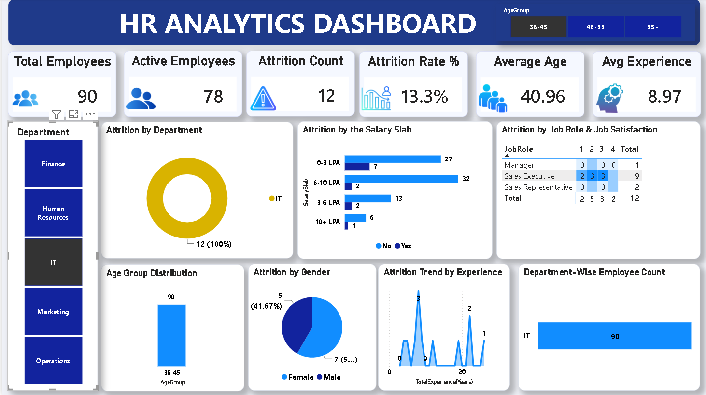

# HR Analytics / Employee Attrition Dashboard

Analysis of employee attrition drivers using Excel and Power BI, aimed at identifying
where the business is losing people and why — to support HR retention decisions.

## Tools Used
- **Excel** — data validation and formula-driven summary analysis (COUNTIFS, SUMIFS)
- **Power BI** — interactive dashboard with DAX measures
- **DAX** — custom measures for Attrition Rate, headcount, and averages

## Dataset
1,480 employee records with 37 attributes: department, job role, overtime status,
job satisfaction, work-life balance, income, tenure, and more.

## Key Insights
- Overall attrition rate: **16.3%** (241 of 1,480 employees)
- **Overtime is the strongest attrition driver**: 31.2% attrition for employees working
  overtime vs. 10.4% for those who aren't — a 3x difference
- **Human Resources** has the highest departmental attrition (26.8%), followed by
  **Sales** (25.2%)
- **Operations** has the lowest attrition (8.3%), despite being the largest department
- Attrition is strongly tied to overtime policy more than any single department factor

## Recommendation
Overtime management is the single strongest lever for reducing attrition in this dataset.
A targeted retention program should prioritize workload/overtime policy review in HR and
Sales specifically, rather than broad, company-wide interventions.

## Files
- `HR_Analytics-4.csv` — raw dataset
- `HR_Analytics-4.xlsx` — Excel workbook with formula-driven summary tables
- `HR_ANALYTICS_DASHBOARD.pbix` — Power BI dashboard
- `screenshots/` — dashboard preview images

## Dashboard Preview

